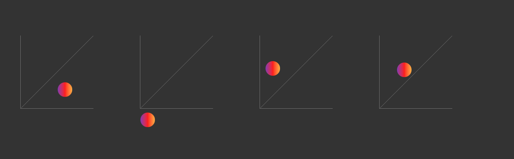

# Animating Objects in CSS in a curved path
The basic approach to this is to have two different timing function for a single object. By default CSS doesn't allow this, so a workaround is to have all the content inside of a `pseudo element` and add different timing functions for tha parent as well ass the pseudo element
---
### Example image below:
